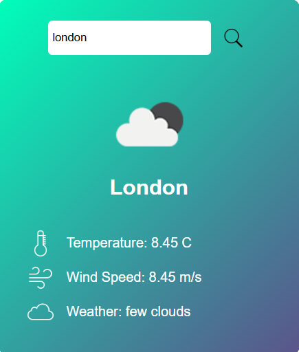

# 🌦️ Weather App

A simple weather application made using HTML, CSS, and JavaScript.
Enter any city name to view temperature, wind speed, and weather condition.

### ✨ Features

• City search<b>
• Temperature in °C<b>
• Wind speed<b>
• Weather description<b>
• Clean and simple UI

### 📸 Screenshot

### 🛠️ Used

• HTML<b>
• CSS<b>
• JavaScript<b>
• OpenWeatherMap API

### ▶️ How to Use

1. Open the project.
2. Enter a city name in the search box.
3. View the weather details.
4. Add your API key inside script.js.

### 🌍 Publish Link (GitHub Pages)

https://adapakavya.github.io/Weather-App/
